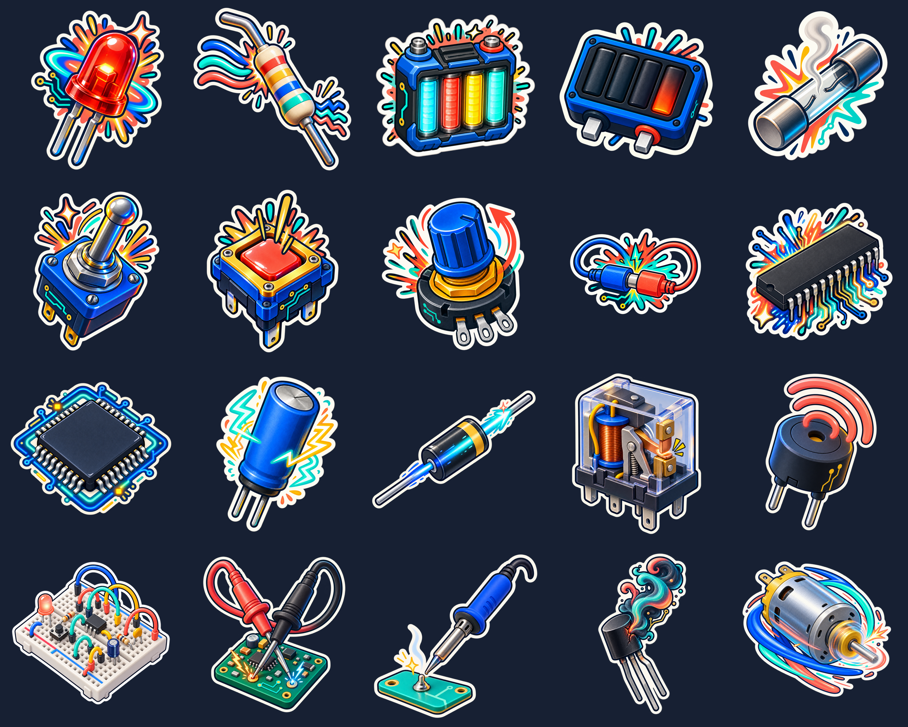

# Bench Bits

Bench Bits is an original, no-code iMessage sticker pack about the emotional life of an electronics workbench. The launch set uses technically recognizable components as reactions: a glowing LED for a good idea, a blown fuse for overload, a motor for “full send,” and so on.

The working title and bundle identifiers are provisional until name clearance and Apple Developer registration. The art deliberately avoids Apple emoji, Apple UI, branded boards, manufacturer marks, and real part numbers.



## Get the developer preview

Bench Bits is currently available as a public Xcode source release. It is not yet a one-tap App Store or TestFlight install.

1. Download the [latest source release](https://github.com/ChristFollower873461/bench-bits/releases/latest).
2. Open `BenchBits.xcodeproj` in stable Xcode 26 or newer.
3. Select your Apple Developer team and replace the provisional bundle identifiers if needed.
4. Build the `BenchBits` scheme for an iPhone or iPad, then open Messages to use the pack.

## Project status

- Product: standalone iMessage Sticker Pack App
- Launch set: 20 static stickers
- Sticker export: 408×408 transparent PNG, under 500 KB each
- Masters: highest-resolution generated PNGs preserved in `artwork/masters/`
- Distribution: public developer preview; planned free App Store launch; no analytics, accounts, ads, SDKs, or data collection
- Source of truth: `project.yml`, generated with XcodeGen 2.46.0

## Local prerequisites

- macOS with `zsh` and `sips`
- Ruby 2.6 or newer
- XcodeGen **2.46.0** (the generated project drift check intentionally pins this version)
- `jq` and ripgrep (`rg`)
- FFmpeg/`ffprobe` for deterministic transparency checks and the optional contact sheet
- Stable Xcode 26 or newer with an iOS platform installed for compile, Simulator, device, archive, and upload checks

## Generate and validate

```bash
./scripts/build-assets.rb
xcodegen generate
./scripts/validate-assets.sh
# Or run the complete local QA pipeline:
./scripts/qa.sh
# Build a dark-background review sheet:
./scripts/make-contact-sheet.rb
```

The asset builder converts the masters into Apple’s regular sticker size, writes the asset-catalog metadata and icon renditions, and preserves the original masters. The QA pipeline fails if generated catalogs or the Xcode project were stale. Full compile, Simulator, device, archive, and TestFlight checks require Xcode 26 or newer.

GitHub Actions runs `./scripts/qa.sh` for pull requests and main pushes using Xcode 26.6 and checksum-verified XcodeGen 2.46.0. It checks generated assets and project drift, then builds Debug for the iOS Simulator and unsigned Release for the device SDK. This does not install the pack in Messages or establish signing, TestFlight, or App Store readiness.

## Art direction

“Workbench Pop” uses chunky simplified geometry, a three-quarter isometric view, matte and translucent materials, brushed-metal leads, deep-navy keylines, warm-white die-cut borders, and a restrained cobalt/aqua/coral/mustard palette. Reactions are communicated with energy, movement, light, sparks, smoke, and switch state—not faces.

See `docs/implementation-brief.md` for acceptance criteria, `docs/qa-note.md` for current evidence and gaps, `docs/release-checklist.md` for the remaining distribution gates, and `artwork/manifest.json` for the ordered launch set and VoiceOver descriptions.
